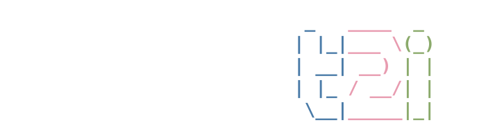

# nano-t2i

<p align="center">
  
</p>

<p align="center">
  
</p>

**A minimal, hackable codebase to train a text-to-image (T2I) flow-matching model end-to-end on the [MONET dataset](https://huggingface.co/datasets/jasperai/monet) — on a single H200 GPU, under \$300.**

---

## Table of contents

- [Overview](#overview)
- [Results](#results)
- [Setup](#setup)
- [Dataset](#dataset)
- [Training](#training)
- [Demo](#demo)
- [Citation](#citation)
- [License](#license)

---

## Overview

`nano-t2i` is a small 1.3B DiT-style **flow-matching** text-to-image model with a Qwen3-4B text encoder and a latent VAE backbone, trained in two phases (512 → 1024) on the [MONET](https://huggingface.co/datasets/jasperai/monet) synthetic captioned-image dataset. It is built on top of [PyTorch Lightning](https://lightning.ai/) and [diffusers](https://github.com/huggingface/diffusers), and is designed to be:

- **Small enough to fit on a single H200 GPU** (the `nano` config: 5 dual-stream + 5 single-stream DiT blocks, 24 attention heads, 128-dim heads, ~ to be filled in by training run).
- **Hackable**: every architectural choice lives in the YAML config (see [`examples/trainings/configs/nano.yaml`](examples/trainings/configs/nano.yaml)).
- **End-to-end reproducible**: from raw MONET shards to a working Gradio demo, in two commands.

## Results

The figure below shows the training progress for two reference runs: 1×H200 and 8×H200. It is rendered directly from the W&B run history via [`scripts/plot_training_curves.py`](scripts/plot_training_curves.py) — no screenshots. See [Regenerating the training-curve plot](#regenerating-the-training-curve-plot) below.

<p align="center">
  
</p>

### Reproduced runs

Cost is computed at **~\$3 / H200 / hour** (representative of major cloud GPU providers; check your own pricing). Click a thumbnail to open the full-resolution image.

| Resolution | Hardware | Wall time | Cost  | Examples after 1 day of training |
|---|---|---|---|---|
| 512  | 1×H200 | 24 h | ~\$72  | <a href="assets/gen_single_1_day_3.jpg"></a> <a href="assets/gen_single_1_day_1.jpg"></a> <a href="assets/gen_single_1_day_2.jpg"></a> <a href="assets/gen_single_1_day_0.jpg"></a> |
| 512  | 8×H200 | 3 h  | ~\$72  | <a href="assets/gen_node_1_day_3.jpg"></a> <a href="assets/gen_node_1_day_1.jpg"></a> <a href="assets/gen_node_1_day_2.jpg"></a> <a href="assets/gen_node_1_day_0.jpg"></a> |

### Planned runs

| Resolution | Hardware | Wall time | Cost   | Status |
|---|---|---|---|---|
| 1024 | 1×H200 | 48 h | ~\$144 | in progress |
| 1024 | 1×H200 | 72 h | ~\$216 | in progress |
| 1024 | 1×H200 | 96 h | ~\$288 | in progress |

## Setup

You need Python `>=3.13` and a CUDA 12.8-compatible driver (PyTorch 2.9 / cu128 wheels are pinned in [`requirements.txt`](requirements.txt)).

Clone the repo first:

```shell
git clone https://github.com/gojasper/nano-t2i.git
cd nano-t2i
```

The recommended install path is `uv`. Two extras are available:
- (default) — inference only: `torch`, `torchvision`, `torchaudio`.
- `[training]` — adds `lightning`, `diffusers`, `transformers`, `wandb`, `webdataset`, `gradio`, etc. (see [`requirements-training.txt`](requirements-training.txt)).

### With `uv` (recommended)

```shell
uv venv envs/nano-t2i --python 3.13
source envs/nano-t2i/bin/activate
uv pip install -e ".[training]"
```

<details>
<summary>Alternative install paths (<code>virtualenv</code>, <code>conda</code>)</summary>

#### With `virtualenv`

```shell
python3.13 -m virtualenv envs/nano-t2i
source envs/nano-t2i/bin/activate
pip install --upgrade pip
pip install -e ".[training]"
```

#### With `conda`

```shell
conda create -n nano-t2i python=3.13
conda activate nano-t2i
pip install --upgrade pip
pip install -e ".[training]"
```

</details>

## Dataset

`nano-t2i` trains on [**MONET**](https://huggingface.co/datasets/jasperai/monet) (Massive, Open, Non-redundant and Enriched Text-to-image dataset), a curated **104.9M** image-text corpus distilled from 2.9B raw pairs across nine open sources (six real, three synthetic) with safety filtering, deduplication (pHash + SSCD), domain governance, and multi-VLM re-captioning. MONET is released under **Apache-2.0** and ships pre-computed SANA-VAE latents for direct latent-diffusion training. See the [dataset card](https://huggingface.co/datasets/jasperai/monet) for full details.

## Training

Training configs live in [`examples/trainings/configs/`](examples/trainings/configs); the main entrypoint is [`examples/trainings/training.py`](examples/trainings/training.py). The reference config is [`nano.yaml`](examples/trainings/configs/nano.yaml), which defines two sequential phases:

1. `nano-512` — 200k steps at 512×512.
2. `nano-1024` — 500k steps at 1024×1024, resumed from phase 1.

```shell
python examples/trainings/training.py --path_config examples/trainings/configs/nano.yaml
```

### Logging with Weights & Biases

Training metrics are logged to W&B under the `Nano-T2I` project (configurable via `logging.wandb_project` in the YAML). To authenticate:

```shell
# interactive
wandb login
# or
export WANDB_API_KEY=...
```

### Checkpoints

Checkpoints are written to the path specified by `training.save_ckpt_path` in each phase of the config (default: `logs/nano/phase-1/` and `logs/nano/phase-2/`). Phase 2 resumes from `logs/nano/phase-1/last.ckpt` by default — make sure phase 1 has completed before launching it.

## Demo

A Gradio demo is provided in [`examples/inference/demo/t2i_demo.py`](examples/inference/demo/t2i_demo.py). It lets you pick a config file and a checkpoint name, and generate images interactively.

```shell
python examples/inference/demo/t2i_demo.py
```

## Citation

If you use this code or the MONET dataset in your research, please cite:

```bibtex
@article{aubin2026monet,
  title   = {MONET: A Massive, Open, Non-redundant and Enriched Text-to-image Dataset},
  author  = {Aubin, Benjamin and Quintana, Gonzalo I{\~n}aki and Tasar, Onur and Sreetharan, Sanjeev and Czerwinska, Urszula and Henry, Damien and Chadebec, Cl{\'e}ment},
  year    = {2026},
  note    = {Jasper Research}
}
```

## License

This codebase is released under the [Apache 2.0 License](LICENSE). The MONET dataset has its own license — please consult the [dataset card](https://huggingface.co/datasets/jasperai/monet) before redistributing.